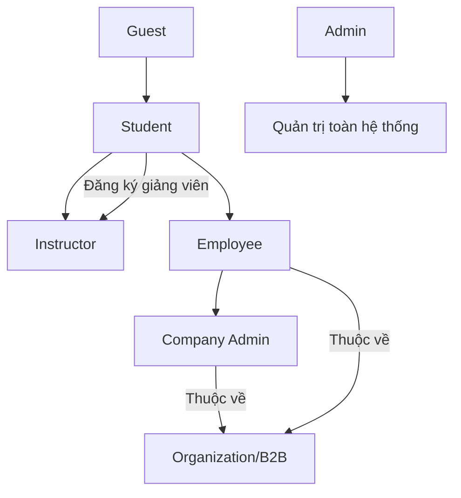
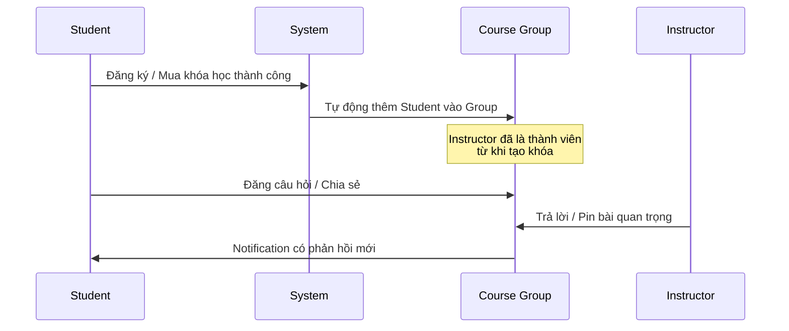
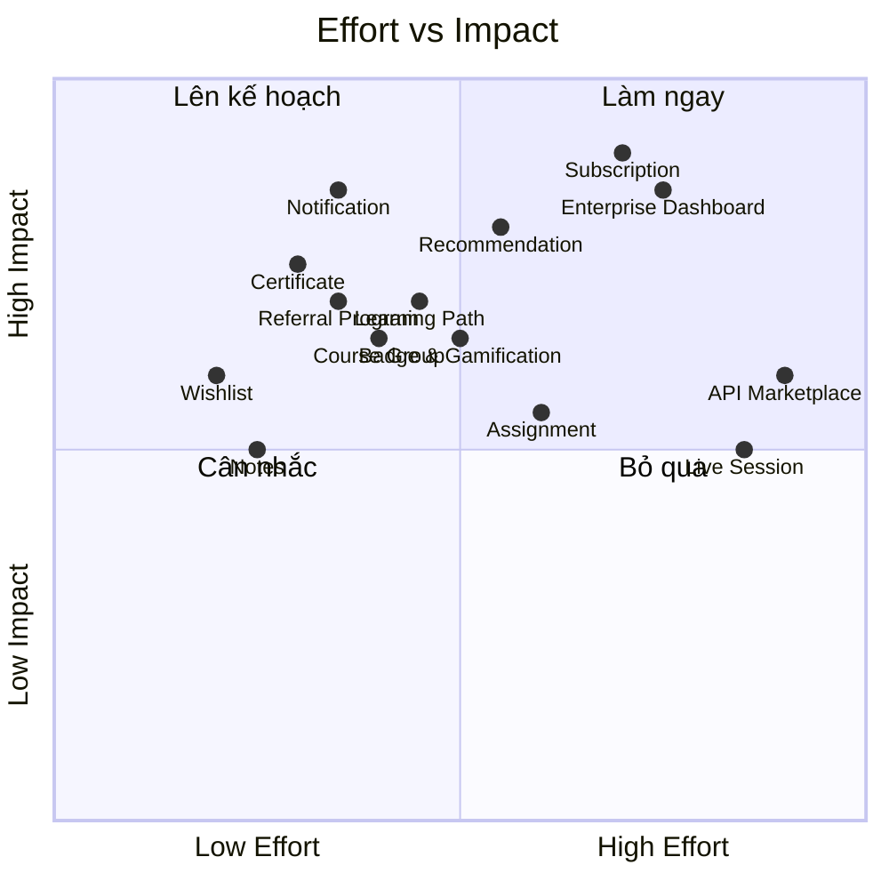

# 📊 Phân Tích Hệ Thống E-Learning & Lộ Trình Phát Triển

## I. Tổng Quan Hệ Thống Hiện Tại

### 🏗️ Kiến Trúc Đa Vai Trò (Multi-Tenant)



| Vai trò | Chức năng chính |
|---------|----------------|
| **Guest** | Xem khóa học, xem preview bài học miễn phí |
| **Student** | Mua/đăng ký khóa, học, làm quiz, đánh giá, comment |
| **Instructor** | Tạo/quản lý khóa học, module, lesson, quiz, ngân hàng câu hỏi, rút tiền |
| **Company Admin** | Quản lý tổ chức, mua license hàng loạt, phân phối cho Employee |
| **Employee** | Học qua license được gán bởi Company Admin |
| **Admin** | Duyệt khóa học, quản lý user, coupon, doanh thu, duyệt payout |

---

### 📦 Các Module Nghiệp Vụ Đã Có

| Module | Mô tả | Mức hoàn thiện |
|--------|-------|---------------|
| **Xác thực & Phân quyền** | Devise + CanCan, 6 vai trò, email confirmation | ✅ Hoàn thiện |
| **Quản lý Khóa học** | CRUD, Module → Lesson, draft/pending/published/rejected | ✅ Hoàn thiện |
| **Hệ thống Bài học** | Video URL, free preview, comment threaded, progress tracking | ✅ Hoàn thiện |
| **Hệ thống Quiz** | Ngân hàng câu hỏi (Easy/Medium/Hard), random generation, scoring, time limit | ✅ Hoàn thiện |
| **Thanh toán Stripe** | Single checkout, cart checkout, webhook xử lý enrollment | ✅ Hoàn thiện |
| **Giỏ hàng** | Cart + CartItem, promo code, tính giá giảm | ✅ Hoàn thiện |
| **Mã giảm giá** | Global/Specific, percentage/fixed, auto-apply + manual code | ✅ Hoàn thiện |
| **Hệ thống Ví** | Wallet, WalletTransaction, phân chia doanh thu 70/30 | ✅ Hoàn thiện |
| **Rút tiền** | PayoutRequest, duyệt/từ chối bởi Admin | ✅ Hoàn thiện |
| **Review & Rating** | 1-5 sao, chỉ review khi >= 70% tiến độ | ✅ Hoàn thiện |
| **B2B / Enterprise** | Organization, License, Employee management | ⚠️ Cơ bản |
| **Tìm kiếm** | Ransack integration, filter theo category/price/rating | ✅ Hoàn thiện |
| **Duyệt khóa học** | Instructor submit → Admin approve/reject | ✅ Hoàn thiện |

---

## II. Phân Tích Điểm Mạnh & Điểm Cần Cải Tiến

### ✅ Điểm mạnh
- Hệ thống phân quyền chặt chẽ với 6 vai trò rõ ràng
- Flow thanh toán hoàn chỉnh qua Stripe với webhook
- Hệ thống quiz nâng cao (random generation, difficulty-based, time limit)
- Cơ chế phân chia doanh thu tự động (70% instructor / 30% platform)
- UI/UX hiện đại với Turbo Frames cho trải nghiệm mượt mà

### ⚠️ Điểm cần cải tiến (Chức năng)
- **Không có hệ thống thông báo** (Notification) cho người dùng
- **Không có Wishlist/Bookmark** — học viên không lưu được khóa yêu thích
- **Không có hệ thống chứng chỉ** (Certificate) sau khi hoàn thành khóa
- **Không có Dashboard Analytics** cho Instructor (thống kê chi tiết)
- **B2B module còn sơ khai** — thiếu reporting, bulk operations
- **Không có hệ thống tin nhắn** giữa student ↔ instructor
- **Thiếu Social Proof & Gamification** — chưa tạo động lực học

---

## III. Lộ Trình Phát Triển Đề Xuất

### 🎯 Phase 0: CÁ NHÂN HÓA QUÁ TRÌNH HỌC TẬP (Thesis Core) 🤖

> [!IMPORTANT]
> Đây là **trọng tâm đề tài tốt nghiệp** — "Hỗ trợ cá nhân hóa quá trình học tập". Tất cả các tính năng trong Phase này PHẢI được ưu tiên triển khai trước.

#### 0.1. 🤖 AI Study Assistant (Trợ lý học tập AI)
**Mục tiêu:** Chatbot AI tích hợp trong trang học, hỗ trợ giải đáp thắc mắc theo ngữ cảnh bài học đang xem.

- Tích hợp **OpenAI / Gemini API** làm backend
- Chatbot hiểu ngữ cảnh: biết student đang học lesson nào, khóa nào
- Gợi ý giải thích thêm, ví dụ minh họa, tóm tắt bài học
- Lưu lịch sử chat theo lesson để student xem lại

```
AiConversation (user_id, lesson_id, course_id, created_at)
AiMessage (ai_conversation_id, role [user/assistant], content, created_at)
```

#### 0.2. 📊 Personal Learning Dashboard (Bảng phân tích cá nhân)
**Mục tiêu:** Mỗi student có dashboard riêng hiển thị insight cá nhân hóa.

| Thành phần | Mô tả |
|-----------|-------|
| **Biểu đồ tiến độ** | Tiến độ theo tuần/tháng, so sánh với bản thân tuần trước |
| **Thời gian học** | Tổng giờ học, trung bình/ngày, thời điểm học hiệu quả nhất |
| **Điểm mạnh/yếu** | Phân tích kết quả quiz → chỉ ra topic cần ôn lại |
| **Learning streak** | Chuỗi ngày học liên tục, nhắc nhở duy trì |
| **Mục tiêu tuần** | Tự đặt mục tiêu (VD: hoàn thành 3 lesson/tuần) |

```
LearningActivity (user_id, course_id, lesson_id, activity_type, duration_seconds, date)
LearningGoal (user_id, goal_type, target_value, current_value, week_start)
```

#### 0.3. 🧠 Adaptive Quiz (Quiz Thích Ứng Năng Lực)
**Mục tiêu:** Hệ thống quiz tự điều chỉnh độ khó dựa trên năng lực thực tế của student.

- Nếu student **trả lời đúng liên tục** → Tăng tỷ lệ câu Hard
- Nếu student **trả lời sai nhiều** → Giảm xuống câu Easy, gợi ý ôn lại lesson
- Sau mỗi quiz → AI phân tích **Knowledge Gap** và gợi ý lesson cần xem lại

> [!NOTE]
> Hệ thống quiz hiện tại đã có `easy_count`, `medium_count`, `hard_count`. Chỉ cần thêm logic adaptive để tự động điều chỉnh tỷ lệ dựa trên `quiz_attempts` trước đó.

```
UserSkillProfile (user_id, course_id, topic, mastery_level [0-100], updated_at)
```

#### 0.4. 🎯 AI Course Recommendation (Gợi Ý Khóa Học Thông Minh)
**Mục tiêu:** Gợi ý khóa học phù hợp dựa trên hành vi và sở thích cá nhân.

| Tín hiệu cá nhân hóa | Logic |
|----------------------|-------|
| Khóa đã hoàn thành | Gợi ý khóa cùng category, level cao hơn |
| Kết quả quiz | Yếu topic nào → gợi ý khóa bổ sung |
| Wishlist & browsing | Gợi ý khóa tương tự những gì đã xem/lưu |
| Học viên tương tự | "Người học giống bạn cũng đã mua..." |

#### 0.5. 📅 Smart Study Planner (Lộ Trình Học Cá Nhân)
**Mục tiêu:** AI tạo lịch học tối ưu cho từng student.

- Student chọn **mục tiêu**: "Hoàn thành khóa trong 2 tuần"
- AI phân bổ lesson theo ngày, dựa trên:
  - Thời gian rảnh (student tự chọn)
  - Tốc độ học hiện tại (từ LearningActivity)
  - Độ khó của lesson (ước lượng từ duration/quiz score)
- Gửi **reminder notification** theo lịch đã tạo
- Tự động điều chỉnh nếu student bị trễ

```
StudyPlan (user_id, course_id, target_date, status, created_at)
StudyPlanItem (study_plan_id, lesson_id, scheduled_date, is_completed)
```

#### 0.6. 📝 AI-Powered Summary & Key Points
**Mục tiêu:** AI tự động tạo tóm tắt và ghi chú trọng điểm cho mỗi bài học.

- Sau khi xem lesson, student nhấn **"AI Tóm tắt"** → Nhận bản tóm tắt ngắn gọn
- Trích xuất **Key Takeaways** từ nội dung lesson
- Tạo **Flashcard** tự động để ôn tập (Spaced Repetition)

---

### 🏷️ Mapping: Các tính năng đã có trên plan liên quan đến Cá nhân hóa

| Tính năng (đã có trong plan) | Khía cạnh Cá nhân hóa | Phase gốc |
|------------------------------|----------------------|-----------|
| **Recommendation Engine** | Gợi ý khóa dựa trên hành vi cá nhân | Phase 2 → **Nâng lên Phase 0** |
| **Notes System** | Ghi chú cá nhân theo ngữ cảnh bài học | Phase 3 |
| **Certificate** | Thành tích cá nhân, xác nhận năng lực | Phase 1 |
| **Badge & Gamification** | Động lực cá nhân hóa, mục tiêu riêng | Phase 5 |
| **Learning Path** | Lộ trình học tùy chỉnh theo năng lực | Phase 2 |
| **Adaptive Quiz** | Quiz thay đổi theo trình độ cá nhân | **MỚI - Phase 0** |

---

### 🎯 Phase 1: Tăng Tương Tác & Giữ Chân Người Dùng (User Retention)

> [!IMPORTANT]
> Đây là phase quan trọng nhất để tăng tỷ lệ quay lại của người dùng, từ đó tăng doanh thu gián tiếp.

#### 1.1. Hệ thống Thông báo (Notification Center)
**Mục tiêu:** Giữ kết nối liên tục với người dùng, nhắc nhở họ quay lại học.

| Loại thông báo | Đối tượng | Trigger |
|----------------|-----------|---------|
| Khóa học mới từ instructor đã follow | Student | Instructor publish course mới |
| Nhắc nhở tiếp tục học | Student | Không hoạt động > 3 ngày |
| Có người review khóa học của bạn | Instructor | Student tạo review |
| Thanh toán thành công | Student | Webhook Stripe |
| Khóa học được duyệt/từ chối | Instructor | Admin approve/reject |
| Flash sale sắp kết thúc | Student | Coupon gần hết hạn |
| Có phản hồi comment mới | Student/Instructor | Comment reply |

**Cấu trúc đề xuất:**
```
Notification (user_id, title, body, notification_type, read_at, actionable_type, actionable_id)
```

#### 1.2. Wishlist / Bookmark Khóa học
**Mục tiêu:** Cho phép student lưu khóa học yêu thích để mua sau → tăng conversion.

- Student bấm **♡ Save** trên course card
- Trang "My Wishlist" hiển thị danh sách khóa đã lưu
- Khi khóa có sale → Gửi notification push "Khóa bạn yêu thích đang giảm giá!"

**Cấu trúc đề xuất:**
```
Wishlist (user_id, course_id, created_at)
```

#### 1.3. Hệ thống Chứng Chỉ (Certificate)
**Mục tiêu:** Tạo giá trị hoàn thành rõ ràng, khuyến khích học viên kết thúc khóa học.

- Tự động cấp khi tiến độ = 100% VÀ đạt tất cả quiz
- Có mã xác thực unique (để verify trên LinkedIn)
- PDF download với template đẹp
- Trang public verify: `/certificates/:code`

**Cấu trúc đề xuất:**
```
Certificate (user_id, course_id, certificate_code, issued_at, template_type)
```

---

### 🎯 Phase 2: Tăng Doanh Thu Trực Tiếp (Revenue Growth)

> [!TIP]
> Các tính năng này nhắm trực tiếp vào việc tăng GMV (Gross Merchandise Value) của platform.

#### 2.1. Hệ thống Gợi ý Khóa học (Recommendation Engine)
**Mục tiêu:** Cross-selling & Up-selling thông minh.

| Chiến lược | Logic | Vị trí hiển thị |
|-----------|-------|-----------------|
| **"Học viên cũng mua"** | Dựa trên enrollment correlation | Course detail page |
| **"Vì bạn đã học..."** | Dựa trên category + level của khóa đã hoàn thành | Homepage, My Courses |
| **"Phổ biến trong danh mục"** | Top enrolled trong cùng category | Course listing |
| **"Tiếp theo bạn nên học"** | Dựa trên learning path sequence | Post-completion page |

#### 2.2. Bundle / Learning Path có giá
**Mục tiêu:** Tăng Average Order Value (AOV).

- Instructor/Admin tạo "Learning Path" = nhóm 3-5 khóa học liên quan
- Mua bundle được giảm 15-25% so với mua lẻ
- Hiển thị progress tổng thể của cả path

**Cấu trúc đề xuất:**
```
LearningPath (title, description, creator_id, price, discount_percentage)
LearningPathCourse (learning_path_id, course_id, order_index)
```

#### 2.3. Subscription Model (Gói Đăng Ký)
**Mục tiêu:** Tạo doanh thu định kỳ (MRR - Monthly Recurring Revenue).

| Gói | Giá | Quyền lợi |
|-----|-----|-----------|
| **Free** | 0₫ | Chỉ khóa miễn phí, giới hạn quiz |
| **Pro** | 199.000₫/tháng | Truy cập toàn bộ khóa học dưới 500K |
| **Premium** | 399.000₫/tháng | Truy cập ALL + Certificate + Priority support |

#### 2.4. Affiliate / Referral Program
**Mục tiêu:** Biến mỗi student thành kênh marketing.

- Mỗi user có referral code unique
- Giới thiệu bạn mua khóa → nhận 10% commission vào ví
- Dashboard tracking referral performance

**Cấu trúc đề xuất:**
```
Referral (referrer_id, referred_user_id, course_id, commission_amount, status)
```

---

### 🎯 Phase 3: Nâng Cấp Trải Nghiệm Học (Learning Experience)

> [!NOTE]
> Phase này tập trung vào việc làm cho platform cạnh tranh được với các đối thủ lớn như Udemy, Coursera.

#### 3.1. Ghi chú Bài học (Notes)
**Mục tiêu:** Tăng engagement trong quá trình học.

- Student ghi chú tại từng timestamp video
- Note liên kết với lesson cụ thể
- Xem lại tất cả notes trong "My Notes" page

**Cấu trúc đề xuất:**
```
Note (user_id, lesson_id, content, video_timestamp, created_at)
```

#### 3.2. Nhóm Trao Đổi Khóa Học (Course Discussion Group)
**Mục tiêu:** Tạo không gian cộng đồng học tập gắn kết giữa Instructor và Student.

> [!NOTE]
> Khác với Comment (gắn theo từng lesson), Discussion Group là một "lớp học ảo" ở cấp khóa học — nơi tất cả thành viên cùng trao đổi, hỏi đáp và chia sẻ.

**Cơ chế hoạt động:**



**Tính năng chi tiết:**

| Tính năng | Mô tả |
|-----------|--------|
| **Auto-join** | Enrollment thành công → tự động thêm vào group |
| **Vai trò trong group** | `owner` (Instructor), `member` (Student), `moderator` (TA/Admin) |
| **Pin message** | Instructor ghim thông báo quan trọng lên đầu |
| **Thread reply** | Trả lời theo luồng, không bị loãng cuộc trò chuyện |
| **@mention** | Tag người cụ thể để hỏi/nhờ giúp |
| **File/Image attach** | Đính kèm screenshot, code snippet, tài liệu |
| **Resolved mark** | Instructor đánh dấu câu hỏi đã được giải quyết |
| **Search trong group** | Tìm kiếm nội dung đã trao đổi trước đó |

**Lợi ích so với Q&A truyền thống:**
- 🤝 **Gắn kết hơn** — Cảm giác như một "lớp học" thay vì một trang hỏi đáp khô khan
- 🔔 **Tương tác real-time** — Notification khi có tin nhắn mới trong group
- 📊 **Instructor quản lý dễ** — Một nơi duy nhất để tương tác với tất cả học viên
- 💡 **Peer learning** — Student hỏi lẫn nhau, chia sẻ kinh nghiệm

**Cấu trúc đề xuất:**
```
CourseGroup (course_id, name, description, created_at)
GroupMembership (course_group_id, user_id, role [owner/moderator/member], joined_at)
GroupMessage (course_group_id, user_id, body, parent_id, is_pinned, is_resolved, created_at)
GroupMessageAttachment (group_message_id, file_url, file_type)
```

#### 3.3. Hệ thống Bài tập (Assignment)
**Mục tiêu:** Đánh giá năng lực thực hành, không chỉ lý thuyết.

- Instructor tạo bài tập mở (tự luận, upload file)
- Student submit bài → Instructor chấm điểm + comment
- Tích hợp vào tiến độ học (ngoài lesson + quiz)

**Cấu trúc đề xuất:**
```
Assignment (lesson_id, title, description, max_score, due_date)
Submission (assignment_id, user_id, content, file_url, score, feedback, status)
```

#### 3.4. Live Session / Webinar
**Mục tiêu:** Tạo trải nghiệm học tương tác real-time.

- Instructor tạo lịch live (integrate Zoom/Google Meet API)
- Student đã enroll được tham gia
- Recording tự động lưu thành lesson mới

---

### 🎯 Phase 4: Mở Rộng B2B & Enterprise

> [!IMPORTANT]
> Module B2B hiện tại còn sơ khai. Đây là nguồn doanh thu lớn nhất nếu phát triển tốt.

#### 4.1. Enterprise Dashboard
- **Báo cáo tiến độ nhân viên**: Tổng quan ai đã hoàn thành, ai đang bỏ dở
- **Báo cáo ROI đào tạo**: Chi phí license vs. skill improvement
- **Custom Learning Path** cho tổ chức
- **Bulk import employee** qua CSV/Excel

#### 4.2. White-Label & Custom Branding
- Cho phép Organization custom logo, màu sắc, domain
- Embed player vào internal portal của doanh nghiệp

#### 4.3. API Marketplace
- Cung cấp REST API cho đối tác integrate
- SDK cho mobile app (React Native / Flutter)
- Webhook events cho third-party integration

---

### 🎯 Phase 5: Gamification & Community

#### 5.1. Hệ thống Điểm & Badge
| Badge | Điều kiện | Lợi ích |
|-------|----------|---------|
| 🌟 First Steps | Hoàn thành khóa đầu tiên | Motivation |
| 🔥 Streak Master | Học liên tục 7 ngày | Retention |
| 💬 Helpful | 10 câu trả lời trong Group được đánh dấu resolved | Community |
| 🏆 Top Reviewer | 5 review chất lượng | Social proof |
| 📚 Bookworm | Hoàn thành 10 khóa | Loyalty |
| 🎓 Scholar | Đạt GPA > 90% trên 5 quiz | Academic credibility |

**Cấu trúc đề xuất:**
```
Badge (name, description, icon, criteria_type, criteria_value)
UserBadge (user_id, badge_id, earned_at)
UserPoint (user_id, points, level)
PointTransaction (user_id, points, reason, source_type, source_id)
```

#### 5.2. Leaderboard
- Bảng xếp hạng theo tuần/tháng/all-time
- Xếp hạng theo: điểm quiz, số khóa hoàn thành, streak
- Phân loại theo category/level

#### 5.3. Instructor Following
- Student follow Instructor yêu thích
- Nhận notification khi có khóa mới
- Trang Instructor Profile công khai (bio, courses, reviews)

**Cấu trúc đề xuất:**
```
Follow (follower_id, followed_id, created_at)
```

---

## IV. Ma Trận Ưu Tiên



---

## V. Đề Xuất Thứ Tự Triển Khai

> [!IMPORTANT]
> Thứ tự đã được sắp xếp lại để ưu tiên **đề tài tốt nghiệp** — các tính năng cá nhân hóa được đưa lên đầu tiên. Các tính năng đánh dấu 🤖 là trực tiếp phục vụ đề tài.

### 🥇 ƯU TIÊN CAO NHẤT — Thesis Core (Cá nhân hóa)
1. 🤖 **Personal Learning Dashboard** — Bảng phân tích tiến độ cá nhân
2. 🤖 **AI Course Recommendation** — Gợi ý khóa học thông minh
3. 🤖 **Adaptive Quiz** — Quiz thích ứng theo năng lực
4. 🤖 **Smart Study Planner** — Lộ trình học cá nhân do AI tạo
5. 🤖 **AI Study Assistant** — Chatbot trợ lý trong trang học
6. 🤖 **AI Summary & Flashcard** — Tóm tắt + ôn tập tự động

### 🥈 Ưu tiên cao — Hạ tầng & Retention
7. **Notification System** — Nền tảng cho reminder/AI alerts
8. **Certificate** — Thành tích cá nhân
9. **Wishlist** — Lưu khóa yêu thích
10. **Notes System** — Ghi chú cá nhân theo bài học

### 🥉 Ưu tiên trung bình — Mở rộng
11. **Badge & Gamification** — Động lực cá nhân hóa
12. **Course Discussion Group** — Cộng đồng học tập
13. **Learning Path / Bundle** — Lộ trình có giá
14. **Referral Program** — Marketing

### 📋 Kế hoạch dài hạn
15. **Assignment System** / **Enterprise Dashboard** / **Subscription**

---

## VI. Cải Tiến Các Chức Năng Có Sẵn

### 6.1. Cải tiến Course Detail Page
- Thêm **"Preview Curriculum"** — cho guest xem outline module/lesson (ẩn nội dung)
- Hiển thị **"Last Updated"** — tạo niềm tin khóa được cập nhật
- Thêm **"Requirements"** & **"What you'll learn"** sections
- Hiển thị **instructor bio** và **số khóa của instructor** ngay trên page

### 6.2. Cải tiến Hệ thống Review
- Cho phép **reply từ Instructor** trên review (public response)
- **Review filtering**: Lọc theo rating, most helpful, most recent
- **Review upvote**: "Was this review helpful?" button
- **Review với media**: Cho phép đính kèm screenshot/file

### 6.3. Cải tiến My Courses (Student Dashboard)
- **Phân loại tab**: "Đang học" / "Hoàn thành" / "Chưa bắt đầu"
- **Progress bar** nổi bật trên mỗi course card
- **"Tiếp tục học"** button — nhảy thẳng đến lesson cuối cùng chưa hoàn thành
- **Learning streak** counter: "Bạn đã học X ngày liên tục!"

### 6.4. Cải tiến Cart & Checkout
- **"Mua cho bạn bè"** (Gift purchase) — Nhập email người nhận
- **Lưu thẻ thanh toán** cho lần mua sau nhanh hơn
- **Thanh toán qua ví** nội bộ (sử dụng Wallet balance hiện có)
- **Installment** (Trả góp) cho khóa học giá cao

### 6.5. Cải tiến Instructor Dashboard
- **Revenue analytics** chi tiết: biểu đồ doanh thu theo ngày/tuần/tháng
- **Student analytics**: Tỷ lệ hoàn thành, điểm quiz trung bình
- **Course performance**: Khóa nào bán chạy, khóa nào cần cải thiện
- **Coupon analytics**: Mã nào hiệu quả nhất

### 6.6. Cải tiến Admin Dashboard
- **Platform KPIs**: GMV, MAU, conversion rate, churn rate
- **Content moderation queue**: Duyệt khóa mới, review có flag
- **Financial overview**: Tổng doanh thu, pending payouts, platform profit
- **User growth chart**: Biểu đồ tăng trưởng người dùng theo thời gian
